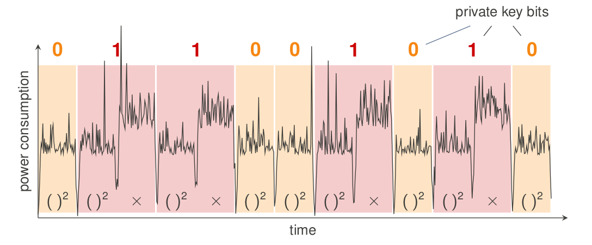
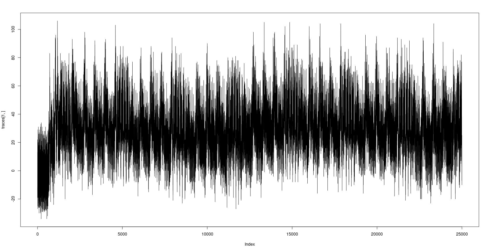
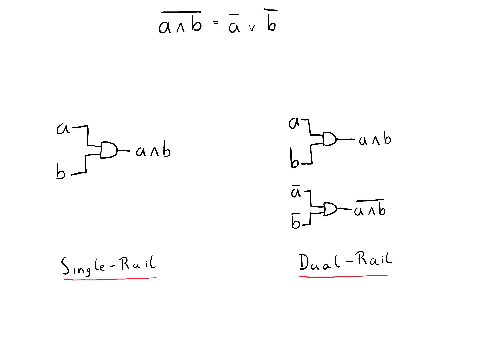
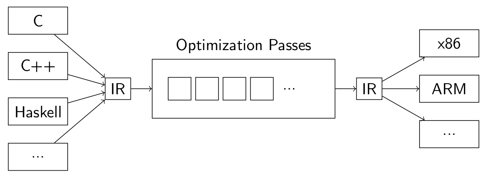
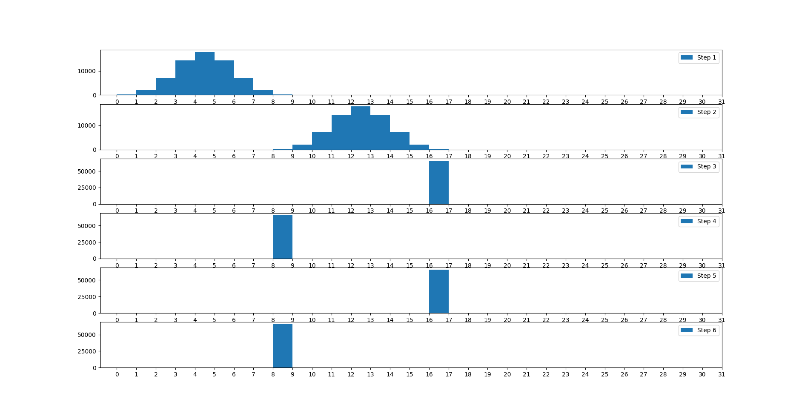

<!--# Status Talk-->
## Towards Balancing Arbitrary Code

---

## Overview
- Power Analysis Attacks
- Power Analysis Defenses
- Project
- Current Status
- Next Steps

---

## Power Analysis Attacks

NOTE: Who was in Infosec2 or Network Security

----


<span style="font-size:12pt;">Network Security: Slideset 2, Devices</span>

NOTE: what is this; easy, right?

----


<span style="font-size:12pt;">Network Security Homework</span>

NOTE: how about now? -> need more sophisticated tools

----

## Statistical Attacks

----

### Requirements
- Power consumption has connection to data
- Data has known link to secret

---

## Power Analysis Defenses

- Masking
- Dual-Rail Logic

----

### Dual-Rail Logic
- Calculate inverse as well
- Power consumption is constant

NOTE: power consumption == Hamming-Weight
NOTE: ask if everyone knows what a Hamming-Weight is

----



---

## Project
NOTE: similar to dual-rail in software; perform calculations on inverse as well, in same register

----

### Outline
- Find balanced arithmetic
- Transform in LLVM compiler
- Evaluate Using QEMU

---

### Balanced Arithmetic


----

`0 | 0 | 0 | x`

----

`0 | ~x | 0 | x`

----

#### X AND Y

```
        0 |        ~X |       0 |       X
        0 |        ~Y |       0 |       Y
        0 | ~X AND ~Y |       0 | X AND Y
        0 | ~X ORR ~Y |       0 | X ORR Y
~X ORR ~Y | ~X AND ~Y | X ORR Y | X AND Y
~X ORR ~Y |         0 |       0 | X AND Y
```

NOTE: after we have arithmetic, we want to transform into it

---

## LLVM PASS

----

### LLVM

NOTE: good to work with, toolchain still complicated

----

```
clang -target arm-none-eabi -mcpu=arm926ej-s -O0 -S -emit-llvm program.c -o program.ll
clang -target arm-none-eabi -mcpu=arm926ej-s -O0 -S -emit-llvm tinyAES.c -o tinyAES.ll
arm-none-eabi-as -ggdb  startup.s -o startup.o
clang -target arm-none-eabi -mcpu=arm926ej-s -O0 rtlib.c -S -emit-llvm -o rtlib.ll
llc rtlib.ll -o rtlib.S
opt -load="../../passes/build/libPasses.so" -insert tinyAES.ll -S -o aes_optimized.ll
opt -load="../../passes/build/libPasses.so" -insert program.ll -S -o optimized.ll
arm-none-eabi-as -ggdb  rtlib.S -o rtlib.o
llc aes_optimized.ll -o aes_optimized.S
llc optimized.ll -o optimized.S
arm-none-eabi-as -ggdb  optimized.S -o program.o
arm-none-eabi-as -ggdb  aes_optimized.S -o tinyAES.o
arm-none-eabi-ld -T startup.ld program.o tinyAES.o startup.o rtlib.o -o program.elf
arm-none-eabi-objcopy -O binary program.elf program.bin
```

---

## Evaluation
- done with QEMU
- saved to JSON

---

## Current Status

----

#### What is done?
- 8bit arithmetic
- QEMU evaluation
- LLVM toolchain

----

#### Preliminary evaluation


----

#### Arithmetic Correctness


---

## Next steps
- Actual balancing pass for 8bit arithmetic
- Extend arithmetic to arbitrary size
- Better performance for multiply, divide, ...
- Think about floats, possibly?
NOTE: getting verifiable results requires a lot of thought
